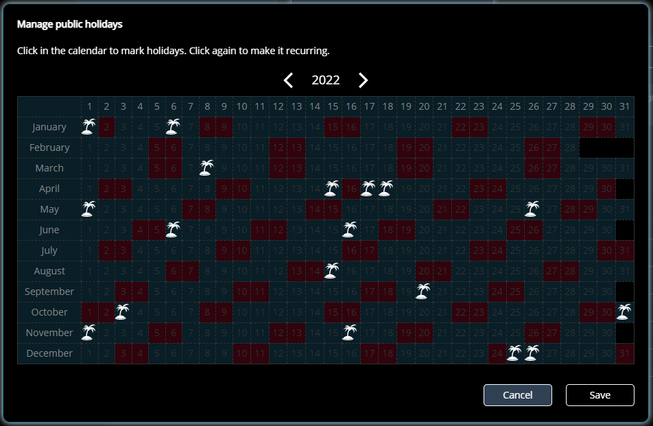

# SIGNL4 Holiday Import aus iCal-Dateien

SIGNL4 bietet eine komfortable Dienst- und Bereitschafts-Planung sowie zeitbasierte Benachrichtigungs-Einstellungen, um Alarme zur richtigen Zeit an die verantwortlichen Personen weiterzuleiten.

Mit zeitbasierten Überschreibungen kannst Du spezielle Benachrichtigungs-Profile für Geschäftszeiten, Wochenenden, Feiertage usw. festlegen. Du kannst Feiertage manuell hinzufügen und bearbeiten oder diese aus iCal-Dateien importieren. Für letzteres stellen wir hier ein Beispiel-Skript zur Verfügung.



## Verwendung und Beispiel-Code

Achtung! Dieser Code ist als Beispiel gedacht und bisher nur wenige getestet. Die Verwendung erfolgt ohne Garantie. Bitte verwenden Sie das Skript mit Vorsicht.

Achtung! Bestehende Dienstpläne werden überschrieben.

Wir stellen ein Beispiel-Node.js-Skript zum Importieren von Dienst-Plänen aus einer CSV-Datei zur Verfügung. Die Beispieldatei verwendet die SIGNL4 REST API wie hier dokumentiert:
[https://connect.signl4.com/api/docs/index.html](https://connect.signl4.com/api/docs/index.html)

Du findest das Import-Skript sowie weitere Informationen auf [GitHub](https://github.com/signl4/signl4-holiday-import).

Voraussetzung ist Node.js, was Du von [hier](https://nodejs.org/en/download/) herunterladen und installieren kannst.

The sample code is provided in the file 'holiday-import.js'. You can execute the wile with the node command. The file takes the path to the .ics file as an argument.

Kommando-Zeilen-Beispiel::

```
    node holiday-import.js C:\holidays.ics
```

Damit werden die Feiertage aus der angegebenen Datei importiert.

Du kannst auch alle Feiertage des laufenden und des folgenden Jahres löschen, indem Du den folgenden Aufruf verwendest:

```
    node holiday-import.js CLEAR
```

In der Quell-Datei musst Du noch den SIGNL4-API-Key und den Team-Namen anpassen:

```
const strAPIKey = 'YOUR-SIGNL4-API-KEY';
const strTeamName = 'Super SIGNL4';
```

Du kannst den API-Key in Deinem SIGNL4-Webportal unter Teams -> Entwickler erstellen.

Der Kommando-Zeilen-Aufruf gibt das Resultat (Erfolg oder Fehler) vom REST API zurück.

## Die iCal-Datei

Die iCal-Datei (.ics) enthält die zu importierenden Feiertage. Du kannst diese Dateien mit Deinen lokalen Feiertagen im Internet finden.

Du kannst das Skript nach Deinen Bedürfnissen anpassen.
